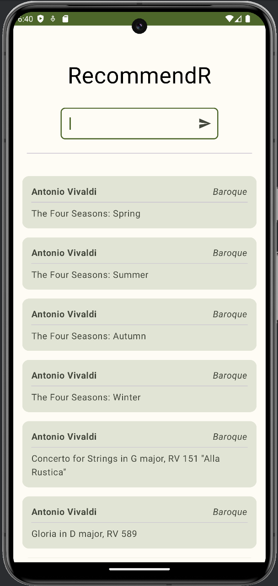
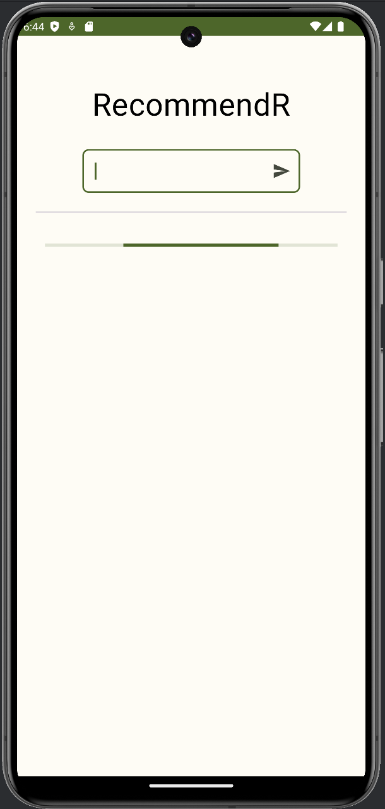
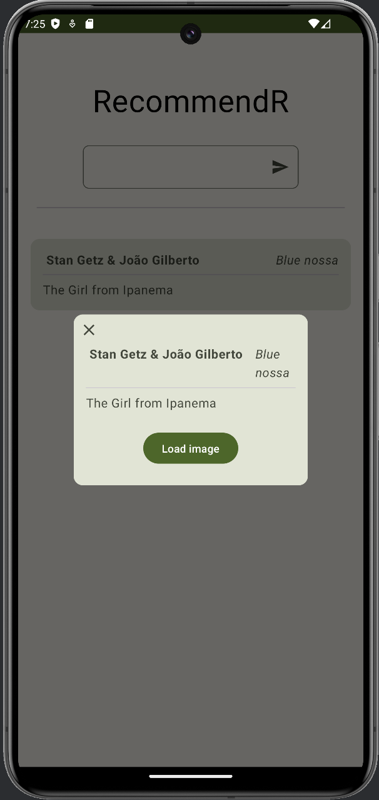
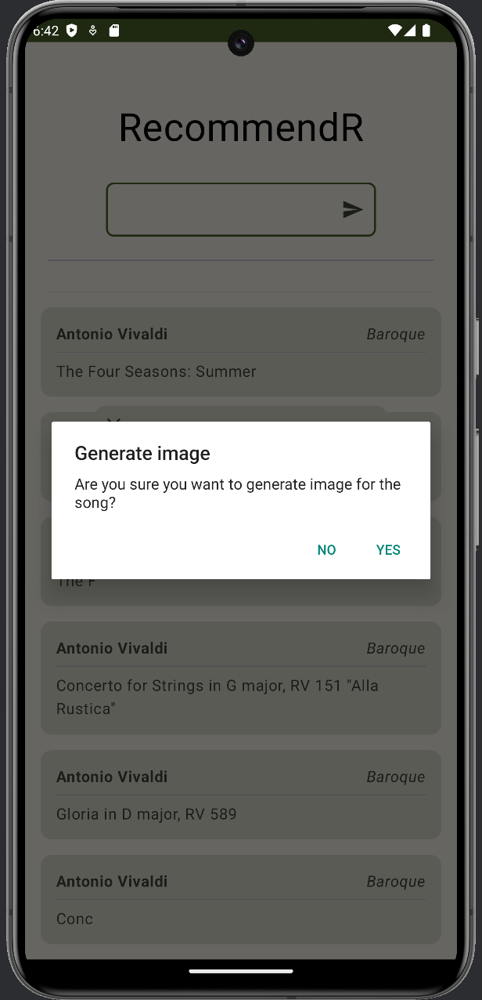
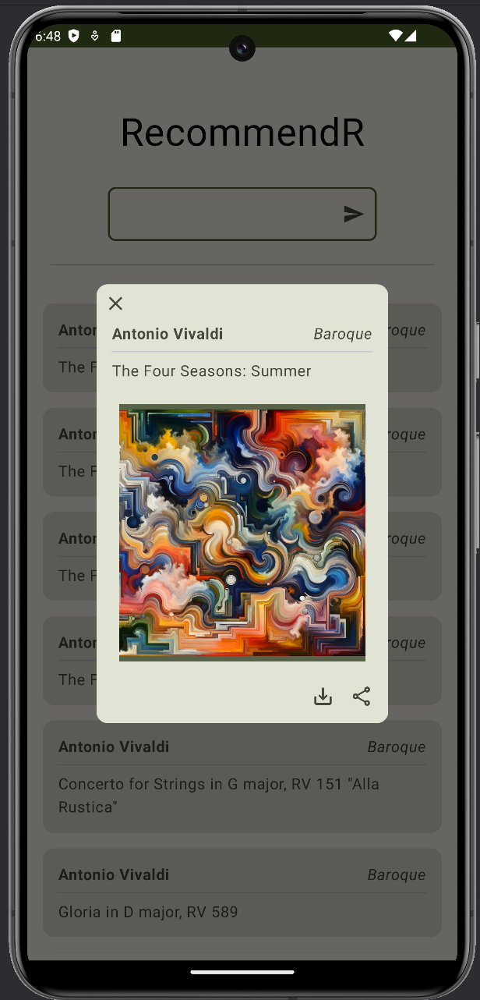
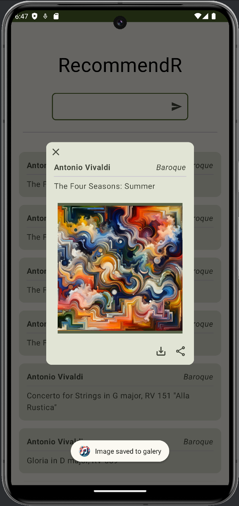
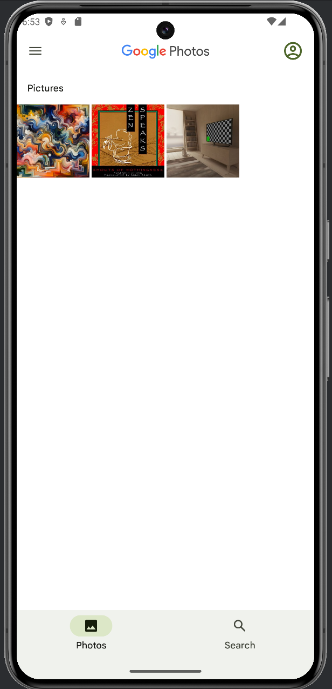

# Prompt Engineering - Házi feladat 

<pre>Készítette:<br>Tick Anna, Prohászka Botond Bendegúz<br>2024 (c)</pre>

Logo:

<a href="./images/logo.jpg"> </a>

## Feladat azonosítója és címe

**Azonosító:** 3

**Cím**: Android app: létre lehet hozni benne listákat, ahol egy rövid leírás alapján az app összeállít, ajánl X darab zenét, mindegyikhez tud képet generálni, és ezeket meg lehet osztani közösségi média appokban.

## Készítők

Az openai api használatához szükséges assistant és thread, valamint az ehhez tartozó backend service osztályok elkészítéséért Prohászka Botond Bendegúz volt felelős. Az android alkalmazást pair programming módszer szerint közösen valósítottuk meg. A dokumentáció írásáért Tick Anna volt felelős.

## Körülmények

A feladat elvégzéséhez először létre kellett hozni a használható threadet és assistantot, melyek segítségével bonyolítja le az alkalmazás a kérdés-válasz (_request-response_) üzeneteket. Ezután össze kellett kötni az alkalmazást a openai-vel, amely több próbálkozás után sikerült. Első próbálkozások alkalmával minden kérést egy külön assistant fogadott, de a felesleges overheadet elkerülve a második megoldás során már ugyanazt az assistant-et használtuk. Az assistant-et még az alkalmazásba való integrálás és használat előtt be kellett üzemelni: ez tartalmazott például néhány minta request-response párost. A végső megoldáshoz szükség volt a threaden egy _messages_ üzenetre, amely tartalmazza azt az utasítást, amely alapján a zenéket össze kell állítania az LLM-nek, majd egy _runs_ parancsra, amely hatására generálja az LLM a választ, majd egy ismételt üres törzsű _messages_ üzenettel lehet lekérni a kapott üzeneteket. Ezek közül az utolsó üzenet a válasz az aktuális promptra.

A zenei listák összeállítására az újonnan megjelent ___gpt-4o___ modellt használtuk.

A képeket szintén az openai szolgáltatja, annak is a dall-e modelljei (többet is kipróbáltunk, anyagi megfontolásokból végül a ___dall-e-2___ modellt használtuk). A modell a képeket a zenék címéből generálja.

A kép mentését a 29-es API szint fölött új módszerrel lehet megoldani, és saját képek mentéséhez nincs szükség futás idejű engedélyre. A kép megosztása más alkalmazásokkal könnyen megvalósítható beépített módon, amely elérhető az Android platformon.

## A feladat megoldása

A feladat megoldása a következő linken érhető el: [github.com](https://github.com/anna806/RecommendR).

Az alkalmazás főképernyőjén található egy beviteli mező, ahol meg lehet adni, hogy mi alapján generáljon ajánlásokat az LLM. A nyílra kattintva lehet elindítani a generálást, melynek eredményeképpen egy lista jelenik meg a generált dalokkal. 

A listaelemeken szerepel a dal címe, szerzője és a parancs, ami alapján a generálás történt. A listaelemre rá lehet kattintani, ilyenkor megnyílik egy ablak, ahol lehet az adott zeneműhöz képet generálni. A képgenerálás gombnál megnyílik egy megerősítő dialógusablak, majd elindul a generálás. Akkor jeleníti meg az alkalmazás a képernyőn, amikor megérkezik a kép.

Az alsó sarokban van egy mentés és egy megosztás gomb. A mentés gomb hatására elmenti az alkalmazás a galériába a képet, majd megjelenít egy üzenetet a mentésről. A megosztás gomb hatására megjelenik egy Android platformon ismert megosztási ablak, ahol ki lehet választani az alkalmazást és elnavigálni a tartalommal a kiválasztott alkalmazásba. 

## Képernyőképek

Az alkalmazás főképernyője: <br>
<a href="./images/screenshots/menu.png"></a>

Töltés a prompt elküldése után: <br>
<a href="./images/screenshots/loading.png"> </a>

Zene megnyitva: <br>
<a href="./images/screenshots/image_song_card.png"></a>

Megerősítő kérdés: <br>
<a href="./images/screenshots/question.png"></a>

Legenerált kép: <br>
<a href="./images/screenshots/image.png"></a>

Mentés után: <br>
<a href="./images/screenshots/image_saved.png"></a>

Megosztás után: <br>
<a href="./images/screenshots/share.png"></a>

Kép a galériában: <br>
<a href="./images/screenshots/image_in_galery.png"></a>


## Promptok

### Létrehozás

Instruction:
```
You are a personal music tutor. You will get a music genre and you will have to recommend 10 songs from that genre. You can use the internet to find the songs. List with title and artist only.
```

### Példák megadása

```python
message = client.beta.threads.messages.create(
  thread_id=thread.id,
  role="user",
  content="opera arias"
)

message = client.beta.threads.messages.create(
  thread_id=thread.id,
  role="assistant",
  content=  "Giacomo Puccini --- Nessun Dorma,,\
            Giuseppe Verdi --- La donna è mobile,, \
            Georges Bizet --- Habanera,, \
            Giacomo Puccini --- O mio babbino caro,, \
            Gioachino Rossini --- Largo al factotum,, \
            Wolfgang Amadeus Mozart --- Der Hölle Rache,, \
            Giacomo Puccini --- E lucevan le stelle,, \
            Gaetano Donizetti --- Una furtiva lagrima,, \
            Camille Saint-Saëns --- Mon coeur s'ouvre à ta voix,, \
            Wolfgang Amadeus Mozart --- Dove sono i bei momenti"
)

message = client.beta.threads.messages.create(
  thread_id=thread.id,
  role="user",
  content="hungarian old pop"
)

message = client.beta.threads.messages.create(
  thread_id=thread.id,
  role="assistant",
  content=  "Omega --- Gyöngyhajú lány,,\
            KFT --- Kétszázhuszonötödik óra,,\
            Ákos --- Maradj még,,\
            Kowalsky Meg A Vega --- Érints meg,,\
            Neoton Família --- Fehér hó,,\
            Republic --- Édes kisfiam,,\
            Péterfy Bori & Love Band --- Egyedül,, \
            Majka --- Olyan Ő,, \
            Beatrice --- Hazug lány,, \
            Quimby --- Engedj be!"
)

```

### Kép generálása

```
Abstract painting for the music: $musicPiece. No text nor letters.
```


## Érdekes tanulságok

- Az openai api integrálásánál a threads használatánál nem elég a prompt üzenet elküldése, szükséges egy runs üzenet is, hogy legenerálja a választ. 

- Az Android platformon egyszerűen meg lehet osztani beépítetten információt másik alkalmazással. 

- A képgenerálás lényegesen költségesebb, mint a szöveg generálása.

- Kifejezetten jó ajánlásokat tud már adni a legújabb LLM modell.